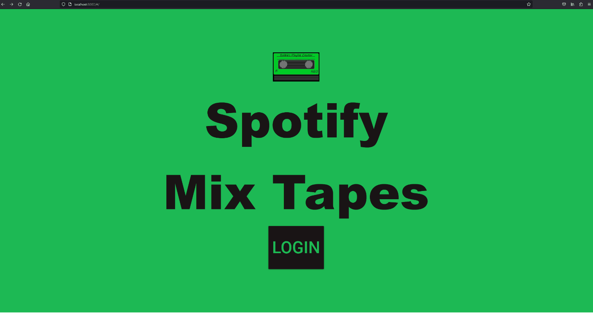
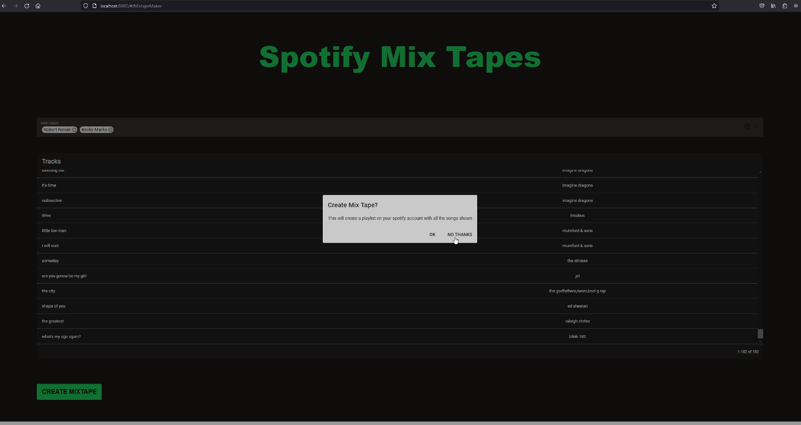

# spotify-mixtape
Combine playlists between you and your friends music taste.

Full stack prototype written in Python (backend) and VueJS 3 with Typescript (frontend)

# Demo

# How To Run
Below are instructions for how to run the full stack web app locally

## Pre-requisitre tools
Make sure the following are installed and configured correctly for use

Using tools: 
* python 3.9
* nvm 1.11.1 (for node version management)
* npm 6.14.9
* node 14.15.3
* local MySQL instance with user:  
  * username: webadmin
  * password webadmin

## Install libraries
1. In frontend-vue run 'npm install'
2. In backend-python run pipenv install

## Executing app
Below are instructions for how to run the frontend and backend of the app

### Frontend
1. Navigate to frontend-vue
2. execute: npm run serve

### Backend
1. Navigate to backend-python
2. execute: python main.py

### Use app
1. Go to localhost:8080 in your browser
2. Click login
3. On your first login, it will ask for your spotfy data.  Allow it.  It may take a few moments to load all your data.

# Screenshots

